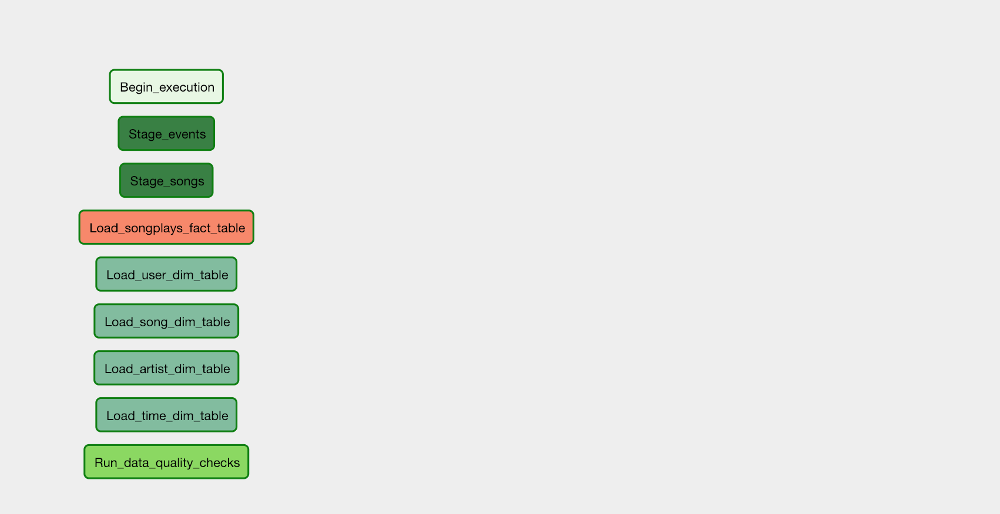

# Data Pipelines with Airflow
This project will introduce you to the core concepts of Apache Airflow. To complete the project, you will need to create your own custom operators to perform tasks such as staging the data, filling the data warehouse, and running checks on the data as the final step.

We have provided you with a project template that takes care of all the imports and provides four empty operators that need to be implemented into functional pieces of a data pipeline. The template also contains a set of tasks that need to be linked to achieve a coherent and sensible data flow within the pipeline.

You'll be provided with a helpers class that contains all the SQL transformations. Thus, you won't need to write the ETL yourselves, but you'll need to execute it with your custom operators.

## Start the Airflow Web Server
You must have the Docker desktop installed.
```bash
cd cd12380-data-pipelines-with-airflow
docker-compose up -d
```
Once all containers are running, you can view the Airflow web server at http://localhost:8080.

## Set Connections in the Airflow Web Server UI


On the Airflow webserver UI page, use `airflow` in both the username and password to login.
* After logging in, add the needed connections through the **Admin > Connections** menu, namely the `aws_credentials` and `redshift` connections.
* Do not forget to start your Redshift cluster from the AWS console.
* After completing all the steps above, you may run your DAG and see if all steps were completed successfully.

## To get started with the project
1. The project template package contains three major components for the project:
   * The **dag template** has all the imports and task templates in place, but the task dependencies have not been set
    * The **operators** folder with operator templates
    * A **helper class** for the SQL transformations
1. With these template files, you should be able see the new DAG in the Airflow UI. The graph view should look like this:
Screenshot of the project DAG in the Airflow UI


You should be able to execute the DAG successfully, but if you check the logs, you will see only `operator not implemented` messages.

## Configuring the DAG
In the DAG, add `default parameters` according to these guidelines
* The DAG does not have dependencies on past runs
* On failure, the task are retried 3 times
* Retries happen every 5 minutes
* Catchup is turned off
* Do not email on retry
In addition, configure the task dependencies so that after the dependencies are set, the graph view follows the flow shown in the image below.


## Building the operators
To complete the project, you need to build four different operators to stage the data, transform the data, and run checks on data quality.

You can reuse the code from Project 2, but remember to utilize Airflow's built-in functionalities as connections and hooks as much as possible and let Airflow do all the heavy lifting when it is possible.

All of the operators and task instances will run SQL statements against the Redshift database. However, using parameters wisely will allow you to build flexible, reusable, and configurable operators you can later apply to many kinds of data pipelines with Redshift and with other databases.

### Stage Operator
The stage operator is expected to be able to load any JSON-formatted files from S3 to Amazon Redshift. The operator creates and runs a SQL COPY statement based on the parameters provided. The operator's parameters should specify where in S3 the file is loaded and what is the target table.

The parameters should be used to distinguish between JSON files. Another important requirement of the stage operator is containing a templated field that allows it to load timestamped files from S3 based on the execution time and run backfills.

### Fact and Dimension Operators
With dimension and fact operators, you can utilize the provided SQL helper class to run data transformations. Most of the logic is within the SQL transformations, and the operator is expected to take as input a SQL statement and target database on which to run the query against. You can also define a target table that will contain the results of the transformation.

Dimension loads are often done with the truncate-insert pattern, where the target table is emptied before the load. Thus, you could also have a parameter that allows switching between insert modes when loading dimensions. Fact tables are usually so massive that they should only allow append type functionality.

### Data Quality Operator
The final operator to create is the data quality operator, which runs checks on the data itself. The operator's main functionality is to receive one or more SQL based test cases along with the expected results and execute the tests. For each test, the test result and expected result need to be checked, and if there is no match, the operator should raise an exception, and the task should retry and fail eventually.

For example, one test could be a SQL statement that checks if a certain column contains NULL values by counting all the rows that have NULL in the column. We do not want to have any NULLs, so the expected result would be 0, and the test would compare the SQL statement's outcome to the expected result.

## Review the Starter Code
Before you start your development, we recommend you to review the following files:
* `plugins/operators/data_quality.py`
* `plugins/operators/load_fact.py`
* `plugins/operators/load_dimensions.py`
* `plugins/operators/stage_redshift.py`
* `plugins/helpers/sql_queries.py`
* `dags/final_project.py`